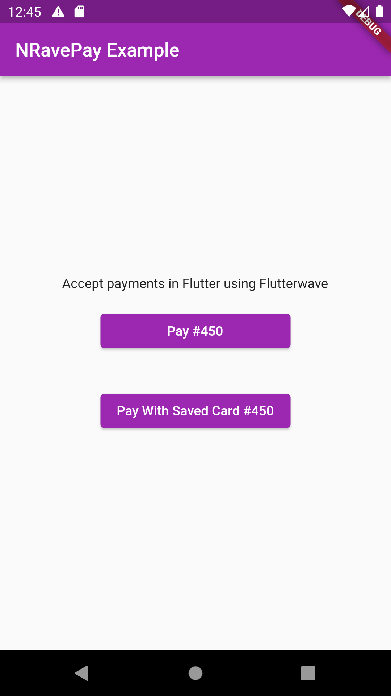
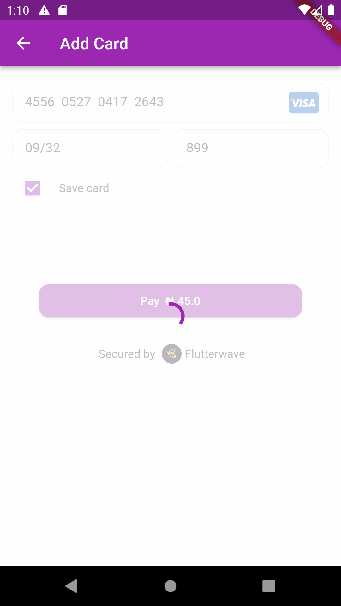
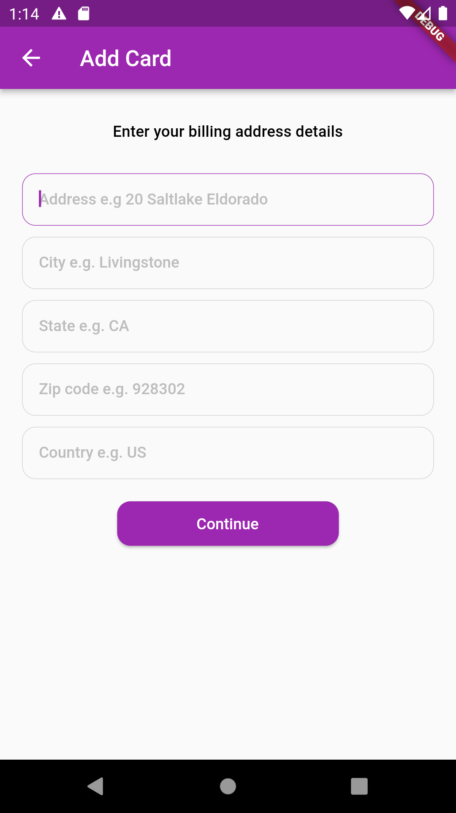

# nravepay

Nravepay is a package that makes accepting card payments in a flutter project easier using [Flutterwave](http://rave.flutterwave.com).
This work is motivated and influenced by [rave_flutter](https://pub.dev/packages/rave_flutter)

## Features

* Custom Flutter native UI
* Save card and pay with token
* Card payments only
* Split payments


## Initialize at Startup

```dart
   void main(){
      NRavePayRepository.setup(
      publicKey: PaymentKeys.publicKey,
      encryptionKey: PaymentKeys.encryptionKey,
      secKey: PaymentKeys.secretKey,
      staging: true);
        ...//other codes
   }
```
## Usage
```dart
     var initializer = PayInitializer(
        amount: 450,
        email: 'email@email.com',
        txRef: 'reference${DateTime.now().microsecondsSinceEpoch}',
        narration: 'New payment',
        country: 'Nigeria',
        currency: 'NGN',
        firstname: 'Nelson',
        lastname: 'Eze',
        useCard: true,
        phoneNumber: '09092343432',
        onComplete: (result) {
          if (result.status == HttpStatus.success) {
            if (result.card != null) {
              print(result.card);
              //  saveCard(card);
            }
          }
          print(result.message);
        });
    return PayManager().prompt(context: context, initializer: initializer);
  }
  
```

## Screenshots








## Bugs/Requests

If you encounter any problems feel free to open an issue.  feature suggestions and Pull requests are also welcome.
